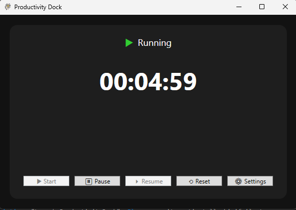
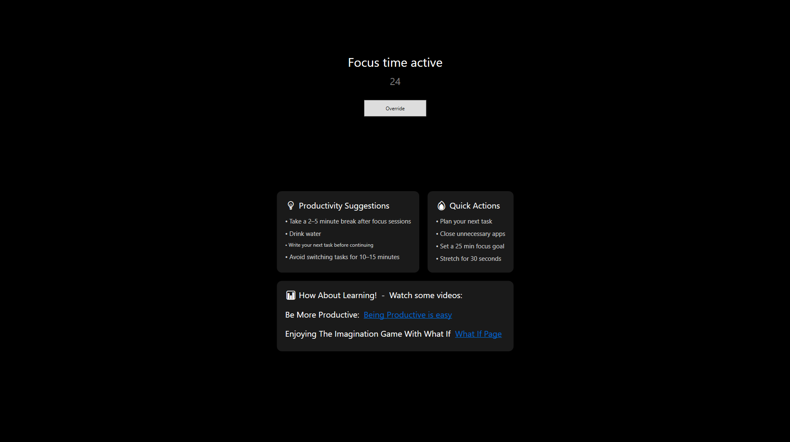
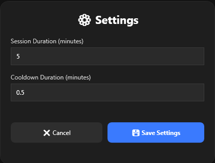

# ProductivityDock 🚀

A lightweight Windows productivity tray app built with **C# WPF**.

ProductivityDock helps you stay focused using a simple **Pomodoro-style timer**, cooldown breaks, and a clean system tray interface — designed to stay out of your way while keeping you productive.

---

## ✨ Features

- ⏱ Focus timer (Pomodoro-style sessions)
- ☕ Cooldown / break sessions
- 🧠 Block screen during breaks (distraction control)
- 🖥 System tray integration (runs quietly in background)
- ⚡ Start / Pause / Resume / Reset controls
- 🎛 Settings window for customizing session & cooldown durations
- 🎯 Minimal and distraction-free UI

---

## 🖼 Screenshots

### 🧭 Main Window (Timer Dashboard)


### 🚫 Block Window (Focus Protection Mode)


### ⚙️ Settings Window


---

## 📦 Download & Installation

### 🚀 Windows Installer (Recommended)

👉 Download the latest version here:
https://github.com/YOUR_USERNAME/ProductivityDock/releases/latest

### Steps:
1. Download `ProductivityDockInstaller.exe`
2. Run the installer
3. Follow setup instructions
4. Launch ProductivityDock from Start Menu

✔ Lightweight  
✔ No login required  
✔ Clean uninstall support  

---

### Option 2 — Run from source
> Requires Visual Studio 2022+ and .NET 10 Windows Desktop SDK

```bash
git clone https://github.com/harfy345/ProductivityDock.git